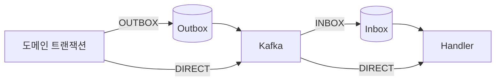

# 신뢰성 모드

[English](reliability.md) | [한국어](reliability.ko.md)

이 문서는 모드를 선택할 때 사용합니다. 실제 설치와 코드는 [빠른 시작](../getting-started/quick-start.ko.md), Handler와 routing은 [소비 가이드](../guides/consuming.ko.md)를 확인합니다.

## 선택표

| 생산자 | 소비자 | 영속화 | 적합한 경우 |
| --- | --- | --- | --- |
| `OUTBOX` | `INBOX` | 양쪽 | 중요한 서비스 간 상태 변경 |
| `OUTBOX` | `DIRECT` | 생산자 | 발행 복구가 필요하고 소비자가 자체 멱등성을 가진 경우 |
| `DIRECT` | `INBOX` | 소비자 | 낮은 발행 지연과 소비자 중복 제거가 필요한 경우 |
| `DIRECT` | `DIRECT` | 없음 | 유실·중복을 허용하는 비핵심 이벤트 |

## 조합별 의미

### Outbox + Inbox

도메인 변경과 Outbox row를 함께 commit하고, 소비자는 Inbox에 저장한 뒤 처리합니다. 발행 복구, 영속 중복 제거와 재시도가 모두 필요한 기본 권장 모드입니다. Kafka 전달은 반복될 수 있지만 같은 `(consumerId, eventId)`는 한 번만 처리합니다.

### Outbox + Direct

생산자는 발행을 복구하지만 소비자는 수신 직후 Handler를 실행합니다. Inbox row와 영속 재시도가 없으므로 Handler가 자연 멱등하거나 비즈니스 멱등성 키를 가져야 합니다.

### Direct + Inbox

생산자는 Kafka로 즉시 발행하고 소비자는 Inbox에 저장합니다. 소비 중복과 실패는 복구하지만, 발행 실패나 도메인 rollback 전에 전송된 이벤트는 복구할 수 없습니다.

### Direct + Direct

양쪽 모두 EventDock 상태를 저장하지 않습니다. 최소 지연 대신 발행 유실, rollback 후 잘못된 이벤트, 중복 실행 가능성을 수용해야 합니다.

## 보장 경계

- Outbox는 생산자 DB와 Kafka 사이를 보호합니다.
- Inbox는 Kafka와 소비자 DB 사이를 보호합니다.
- Inbox 멱등성은 `(consumerId, eventId)` 범위입니다.
- Kafka `group-id`는 전달 범위이며 Inbox 멱등성 키가 아닙니다.
- 어떤 모드도 여러 DB와 외부 시스템을 하나의 원자적 트랜잭션으로 묶는 분산 exactly-once를 제공하지 않습니다.

서비스·인스턴스·공유 DB별 식별 규칙은 [Consumer 식별과 멱등성](consumer-identity.ko.md)을 확인합니다.
