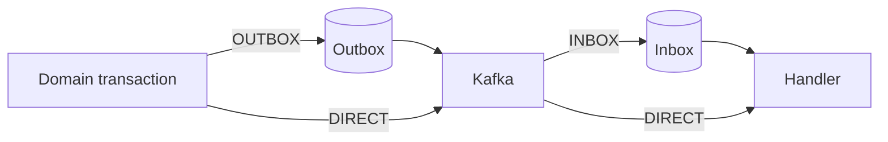

# Reliability Modes

[English](reliability.md) | [한국어](reliability.ko.md)

Use this page to choose a mode. See [quick start](../getting-started/quick-start.md) for installation and code, and [consuming events](../guides/consuming.md) for handlers and routing.

## Selection table

| Producer | Consumer | Persistence | Suitable for |
| --- | --- | --- | --- |
| `OUTBOX` | `INBOX` | both | important state changes between services |
| `OUTBOX` | `DIRECT` | producer | recoverable publication with consumer-owned idempotency |
| `DIRECT` | `INBOX` | consumer | low publication latency with consumer deduplication |
| `DIRECT` | `DIRECT` | none | non-critical events that tolerate loss and duplicates |

## Combination semantics

### Outbox + Inbox

The domain change and Outbox row commit together; the consumer persists receipt before processing. This recommended default provides publication recovery, durable deduplication, and retries. Kafka may redeliver, but the same `(consumerId, eventId)` is processed once.

### Outbox + Direct

The producer can recover publication while the consumer invokes its handler immediately. There is no Inbox row or durable consumer retry, so the handler needs natural or business-key idempotency.

### Direct + Inbox

The producer publishes immediately and the consumer persists to Inbox. Consumer duplicates and failures are recoverable, but publication failures and events sent before a domain rollback are not.

### Direct + Direct

Neither side stores EventDock state. Minimum latency requires accepting publication loss, events surviving a later rollback, and duplicate handler execution.

## Guarantee boundary

- Outbox protects the producer database-to-Kafka boundary.
- Inbox protects the Kafka-to-consumer-database boundary.
- Inbox idempotency is scoped by `(consumerId, eventId)`.
- Kafka `group-id` defines delivery scope and is not part of the Inbox idempotency key.
- No mode provides distributed exactly-once across multiple databases and external systems.

See [consumer identity and idempotency](consumer-identity.md) for service, instance, and shared-database rules.
