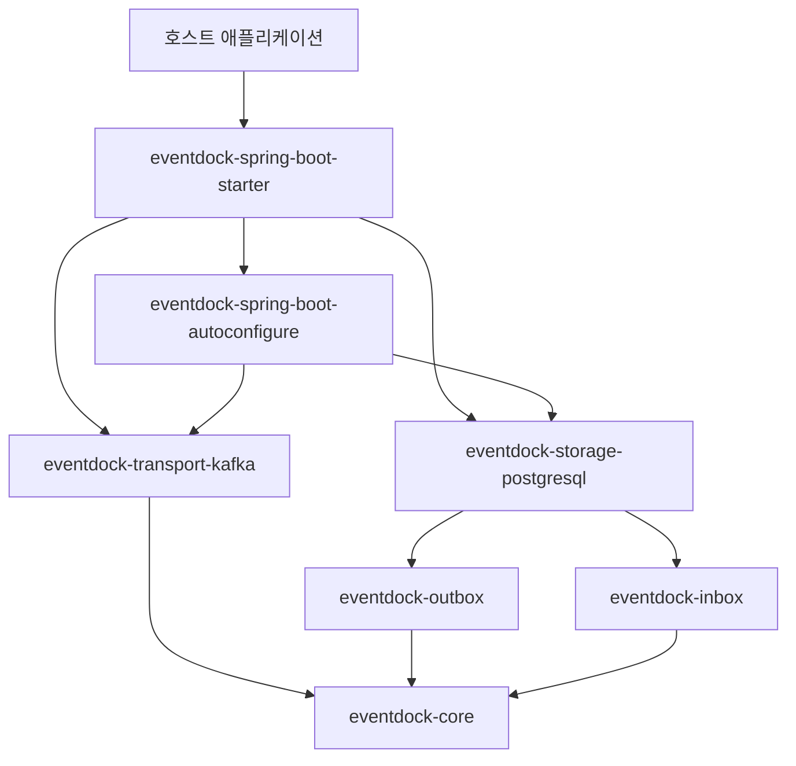
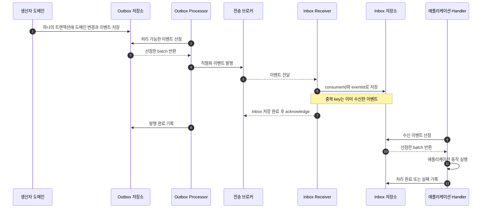
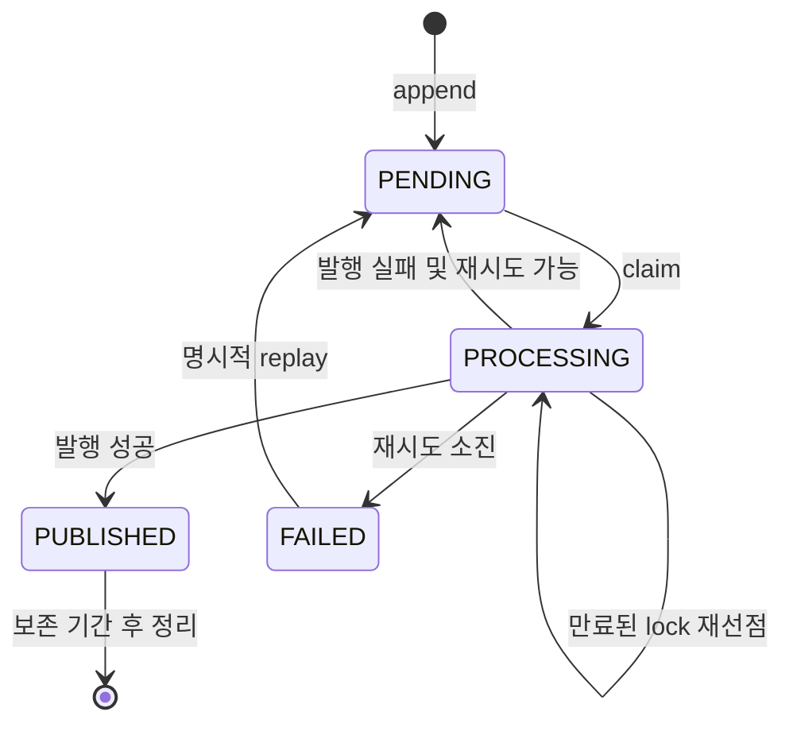
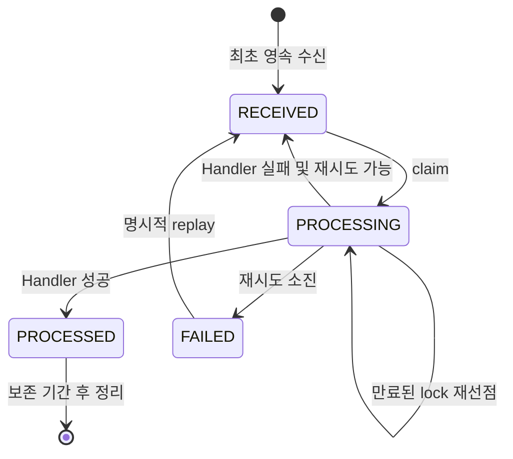
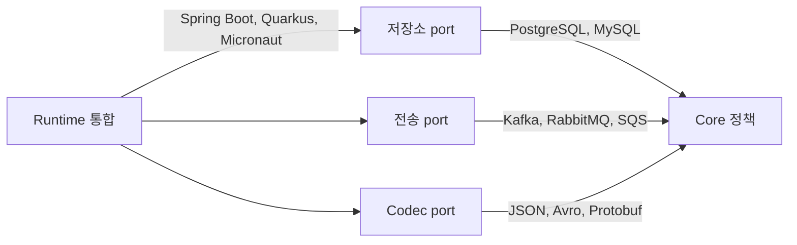

# EventDock 시스템 설계

[English](system-design.md) | [한국어](system-design.ko.md)

## 1. 목적

EventDock은 신뢰할 수 있는 이벤트 전달을 위한 프레임워크 독립적인 구성 요소를 제공합니다. 생산자의 Transactional Outbox와 소비자의 멱등성 Inbox를 결합하되 저장소, 전송 기술, 직렬화 방식 및 프레임워크 통합은 교체할 수 있게 설계합니다.

최초 지원 환경은 Java 21, PostgreSQL, Kafka 및 Spring Boot 4.1입니다. 이 기술들은 core 요구사항이 아니라 어댑터입니다.

## 2. 설계 원칙

- Core 모듈에는 계약, 정책 및 결정적인 상태 전이만 둡니다.
- Outbox와 Inbox는 이벤트 envelope을 공유하는 독립 기능입니다.
- 기술 의존성은 어댑터 내부에 둡니다.
- 저장소 어댑터는 호스트 애플리케이션이 시작한 트랜잭션에 참여합니다.
- 처리는 at-least-once 방식이며 소비자는 중복 전달을 예상해야 합니다.
- 기본 동작은 안전하고 관측 가능하며 명시적인 port를 통해 교체할 수 있어야 합니다.
- 공개 계약은 major 버전 안에서 호환성을 유지합니다.

## 3. 모듈 경계

Core 모듈은 Spring, Jakarta Persistence, Kafka, Jackson, Lombok 또는 데이터베이스 드라이버 타입을 import하지 않습니다. 어댑터는 core 모듈에 의존할 수 있지만 core 모듈은 어댑터에 의존하지 않습니다.

## 4. 이벤트 계약

`EventEnvelope<T>`는 직렬화 전 이벤트를 나타냅니다. `SerializedEvent`는 저장소 및 전송 어댑터가 사용하는 안정적인 경계입니다.

| 필드 | 의미 | 규칙 |
| --- | --- | --- |
| `id` | 전역에서 고유한 이벤트 식별자 | 필수이며 변경 불가 |
| `type` | 안정적인 비즈니스 이벤트 이름 | Java 클래스 이름을 사용하지 않음 |
| `schemaVersion` | Payload 계약 버전 | 양의 정수 |
| `aggregate.type` | Aggregate 분류 | 기술 중립적인 문자열 |
| `aggregate.id` | Aggregate 식별자 | 숫자, UUID 및 복합 ID를 지원하도록 문자열 사용 |
| `aggregate.version` | 단일 Aggregate 내부 이벤트 순서 | 순서 정책 사용 시 0 이상이며 단조 증가 |
| `occurredAt` | 비즈니스 이벤트 발생 시각 | UTC instant |
| `contentType` | 직렬화된 payload 형식 | 예: `application/json` |
| `payload` | 직렬화된 이벤트 데이터 | Codec 외부에서는 해석하지 않는 byte 배열 |
| `metadata` | 추적 및 애플리케이션 metadata | 문자열 key-value이며 기본적으로 민감 정보 제외 |

이벤트 타입 이름과 스키마 버전은 애플리케이션이 소유하는 계약입니다. Java 패키지나 클래스 리팩터링으로 이벤트 타입이 바뀌어서는 안 됩니다.

## 5. 전체 처리 흐름

생산자 트랜잭션은 도메인 변경과 Outbox append를 포함합니다. 브로커 발행은 이후에 실행됩니다. 소비자는 Inbox 저장이 완료된 후에만 브로커 메시지를 acknowledge합니다.

## 6. Outbox 생명주기

원자적인 선점은 저장소 어댑터만 수행합니다. 선점 작업은 처리 가능하거나 lock이 만료된 항목을 선택하고 두 worker가 같은 항목을 동시에 소유하지 못하도록 처리 소유권을 할당합니다.

## 7. Inbox 생명주기

Inbox 식별자는 `consumerId`와 `eventId`의 조합입니다. 서로 다른 논리 소비자는 같은 이벤트를 각각 한 번씩 처리할 수 있습니다. 같은 소비자에게 재전달된 이벤트는 새로운 Inbox 항목을 생성하지 않습니다.

## 8. 전달 및 순서 보장

EventDock은 다음을 보장합니다.

- 같은 로컬 트랜잭션을 사용할 때 도메인 변경과 Outbox append의 원자성
- Outbox에서 전송 기술까지 at-least-once 발행
- Inbox 소비자별 영속적인 중복 제거
- Lock 만료를 통한 중단된 처리 복구
- 실패 이력을 포함한 제한된 재시도
- 선택 가능한 Aggregate 순서 정책

EventDock은 다음을 보장하지 않습니다.

- End-to-end exactly-once 실행
- 데이터베이스와 브로커 사이의 분산 트랜잭션
- 서로 다른 Aggregate 또는 브로커 partition 사이의 전역 순서
- 서로 다른 payload 스키마 버전 사이의 자동 호환성

Kafka 전송은 같은 Aggregate의 이벤트가 동일 partition에 들어가도록 Aggregate 식별자를 기본 record key로 사용합니다. 브로커 재전달과 애플리케이션 재시도로 처리 순서가 달라질 수 있으므로 Inbox 순서 정책은 여전히 명시적으로 적용합니다.

## 9. 확장 지점

- 데이터베이스는 `eventdock-storage-<database>`로 추가합니다.
- 브로커는 `eventdock-transport-<broker>`로 추가합니다.
- 직렬화 방식은 `eventdock-codec-<format>`으로 추가합니다.
- 프레임워크 연결은 통합, 자동설정 또는 Starter 모듈로 추가합니다.
- 공개 정책 계약 자체를 변경할 필요가 없다면 재시도 및 순서 동작은 정책 구현으로 추가합니다.

## 10. 트랜잭션 및 Runtime 소유권

Core Processor는 트랜잭션을 시작하거나 스레드를 생성하거나 작업을 예약하지 않습니다. 호스트 Runtime이 해당 책임을 소유합니다. 저장소 어댑터는 호스트 트랜잭션에 참여하고 프레임워크 통합 모듈은 자체 Scheduler에서 한 번의 처리 주기를 호출합니다.

이 경계를 통해 Spring Boot, Quarkus, Micronaut 또는 순수 Java Executor에서도 상태 전이 로직을 변경하지 않고 같은 core 동작을 실행할 수 있습니다.

## 11. 관측성과 운영

어댑터는 대기, 처리 중, 발행 완료, 처리 완료 및 실패 항목 수와 선점·처리 지연, 재시도 횟수, 만료된 lock 복구 및 cleanup 수를 측정할 수 있어야 합니다. 프레임워크 통합은 이를 Micrometer 또는 다른 telemetry 시스템에 연결할 수 있습니다.

Replay는 명시적인 관리 작업입니다. 이벤트 ID를 유지하고 작업 이력을 기록하며 재시도 또는 순서 정책을 조용히 우회해서는 안 됩니다. 로그와 metadata는 기본적으로 payload나 비밀 정보를 노출하지 않습니다.

## 12. 초기 구현 결정

- PostgreSQL 저장소는 JDBC와 데이터베이스 전용 원자적 claim SQL을 사용합니다.
- Kafka 전송은 Aggregate 식별자를 기본 key로 사용해 `SerializedEvent`를 발행합니다.
- JSON 지원은 core에 포함하지 않고 별도 codec으로 구현합니다.
- Spring Boot 자동설정은 애플리케이션이 port 구현체를 제공하면 적용되지 않습니다.
- 데이터베이스 마이그레이션은 버전이 지정된 resource로 제공합니다. Starter는 기본적으로 멱등 DDL을 적용하며 외부 마이그레이션 도구에 소유권을 맡길 수도 있습니다.

## 13. 미결정 사항

- Correlation, causation, source 및 tracing을 위한 정확한 metadata key
- Aggregate version gap 발견 시 strict ordering 동작
- 재시도 backoff 기본값과 오류 정보 최대 보존 범위
- PostgreSQL 테이블 및 schema 이름 사용자 설정 방식
- 공개 replay 및 운영 관리 API의 경계

각 어댑터를 안정 버전으로 선언하기 전에 관련 결정을 확정해야 합니다.
