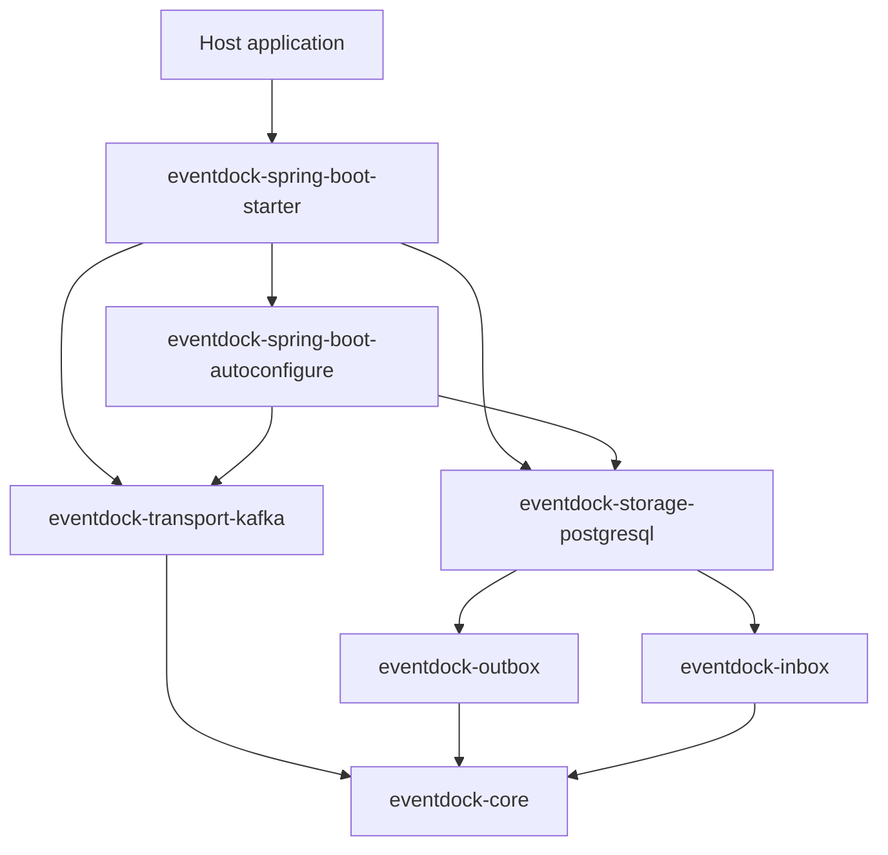
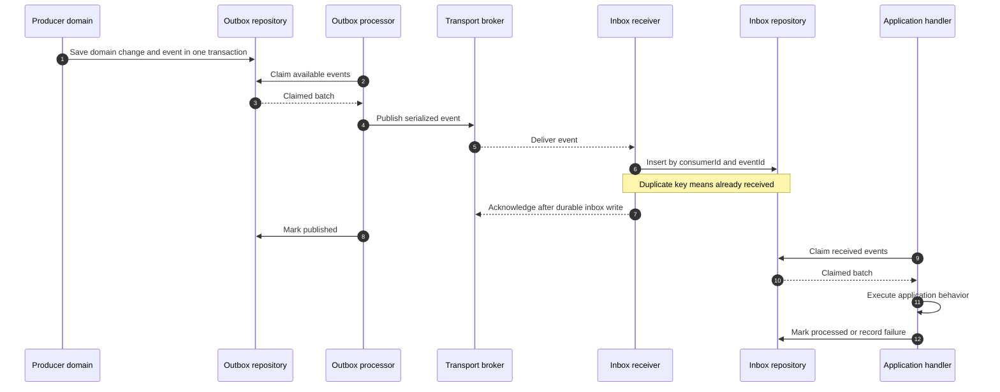
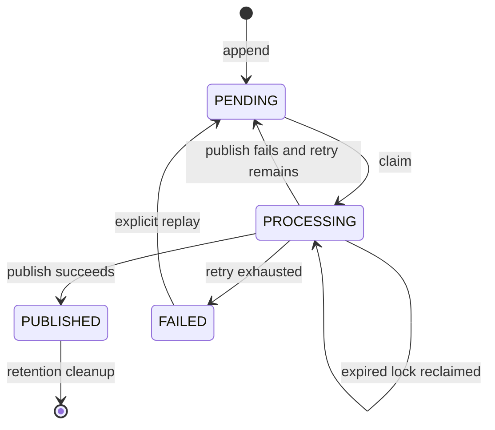
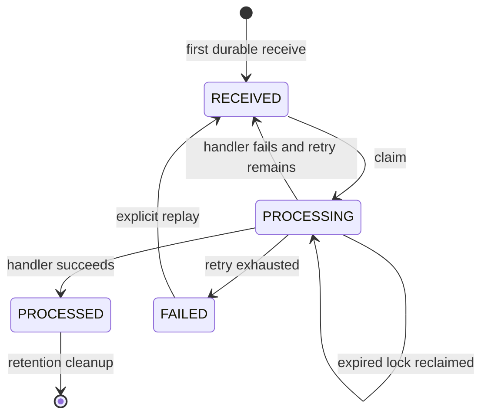
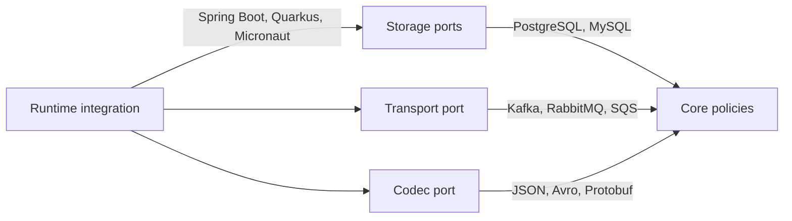

# EventDock system design

[English](system-design.md) | [한국어](system-design.ko.md)

## 1. Purpose

EventDock provides framework-independent building blocks for reliable event delivery. It combines a transactional outbox for producers with an idempotent inbox for consumers while keeping storage, transport, serialization, and framework integrations replaceable.

The first supported stack is Java 21, PostgreSQL, Kafka, and Spring Boot 4.1. These technologies are adapters, not core requirements.

## 2. Design principles

- Core modules contain contracts, policies, and deterministic state transitions only.
- Outbox and inbox are independent features that share the event envelope.
- Technology dependencies stay in adapters.
- Storage adapters participate in the transaction started by the host application.
- Processing is at-least-once; consumers must expect duplicate delivery.
- Defaults are safe, observable, and replaceable through explicit ports.
- Public contracts remain stable within a major version.

## 3. Module boundaries

Core modules must not import Spring, Jakarta Persistence, Kafka, Jackson, Lombok, or database driver types. Adapters may depend on core modules, but core modules never depend on adapters.

## 4. Event contract

`EventEnvelope<T>` represents an event before serialization. `SerializedEvent` is the stable boundary used by storage and transport adapters.

| Field | Meaning | Rule |
| --- | --- | --- |
| `id` | Globally unique event identifier | Required and immutable |
| `type` | Stable business event name | Must not be a Java class name |
| `schemaVersion` | Payload contract version | Positive integer |
| `aggregate.type` | Aggregate category | Technology-neutral string |
| `aggregate.id` | Aggregate identifier | String to support numeric, UUID, and composite IDs |
| `aggregate.version` | Event order within one aggregate | Non-negative and monotonic when ordering is enabled |
| `occurredAt` | Business occurrence time | UTC instant |
| `contentType` | Serialized payload format | For example `application/json` |
| `payload` | Serialized event data | Opaque bytes outside codecs |
| `metadata` | Trace and application metadata | String key-value pairs; no sensitive data by default |

Event type names and schema versions are application-owned contracts. Refactoring a Java package or class must not change an event type.

## 5. End-to-end processing

The producer transaction covers the domain change and outbox append. Broker publication happens later. On the consumer side, the broker acknowledgment occurs only after the inbox write is durable.

## 6. Outbox lifecycle

Only the storage adapter performs an atomic claim. A claim selects available or expired entries and assigns processing ownership without allowing two workers to own the same entry concurrently.

## 7. Inbox lifecycle

Inbox identity is the pair of `consumerId` and `eventId`. Different logical consumers may process the same event once each. Redelivery to the same consumer must not create another inbox entry.

## 8. Delivery and ordering guarantees

EventDock guarantees:

- atomic domain mutation and outbox append when both use the same local transaction;
- at-least-once publication from outbox to transport;
- durable deduplication per inbox consumer;
- recovery of abandoned processing through lock expiration;
- bounded retries with failure history;
- optional aggregate ordering policies.

EventDock does not guarantee:

- end-to-end exactly-once execution;
- a distributed transaction between a database and broker;
- global ordering across aggregates or broker partitions;
- automatic compatibility between different payload schema versions.

Kafka transport should use aggregate identity as the default record key so events for one aggregate reach the same partition. Inbox ordering still remains explicit because broker redelivery and application retries can alter processing order.

## 9. Extension points

- Add a database through `eventdock-storage-<database>`.
- Add a broker through `eventdock-transport-<broker>`.
- Add serialization through `eventdock-codec-<format>`.
- Add framework wiring through an integration, auto-configuration, or starter module.
- Add retry or ordering behavior as a policy implementation unless the public policy contract itself must change.

## 10. Transaction and runtime ownership

Core processors do not start transactions, create threads, or schedule work. The host runtime owns those concerns. A storage adapter joins the host transaction, and a framework integration invokes one processing cycle on its scheduler.

This boundary permits the same core behavior to run under Spring Boot, Quarkus, Micronaut, or a plain Java executor without changing state-transition logic.

## 11. Observability and operations

Adapters should expose metrics for pending, processing, published, processed, and failed entries; claim and processing latency; retry count; expired-lock recovery; and cleanup count. Framework integrations may map these measurements to Micrometer or another telemetry system.

Replay is an explicit administrative action. It must preserve the event ID, record the operation, and avoid silently bypassing retry or ordering policies. Logs and metadata must not expose payloads or secrets by default.

## 12. Initial implementation decisions

- PostgreSQL storage uses JDBC and database-native atomic claim SQL.
- Kafka transport publishes `SerializedEvent` with aggregate identity as the default key.
- JSON support is implemented as a separate codec rather than embedded in core.
- Spring Boot auto-configuration backs off when the application provides a port implementation.
- Database migrations are versioned resources and are never applied silently by core modules.

## 13. Open decisions

- Exact metadata keys for correlation, causation, source, and tracing
- Strict-order behavior when an aggregate version gap is detected
- Retry backoff defaults and maximum error retention
- PostgreSQL table and schema naming customization
- Whether `0.1.0` ships JSON codec as a separate module or through the starter
- Public replay and operational management API boundaries

These decisions must be resolved before the relevant adapter is considered stable.
