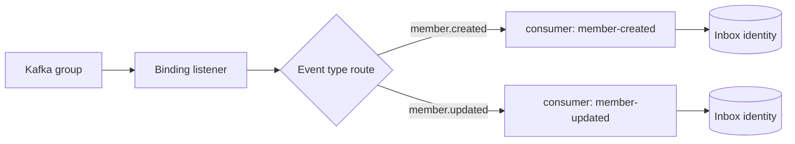

# Kafka 전송

[English](kafka.md) | [한국어](kafka.ko.md)

`eventdock-transport-kafka`는 Spring에 의존하지 않고 `SerializedEvent`를 Kafka record로 변환합니다. payload는 raw byte로 유지하며 이벤트 식별자, schema, aggregate, 발생 시각, content type 및 사용자 metadata는 Kafka header에 저장합니다.

기본 topic은 event type이고 record key는 `<aggregate-type>:<aggregate-id>`입니다. Topic 이름 규칙이 다르면 `KafkaTopicResolver`를 교체할 수 있습니다.

발행은 broker 응답을 기다립니다. 전송 실패나 timeout이 발생하면 Outbox 재시도 정책이 동작합니다. 전달 방식은 at-least-once이므로 consumer는 멱등성을 위해 Inbox 경로를 사용해야 합니다.

수신 record는 Kafka listener가 반환되기 전에 Inbox에 저장됩니다. Starter가 기존 JSON Kafka 흐름과 분리된 `ByteArraySerializer` 및 `ByteArrayDeserializer` 전용 factory를 제공합니다.

## Consumer binding

Spring Boot 어댑터는 `eventdock.consumers` 항목마다 listener container 하나를 생성합니다. Kafka `group-id`는 partition 분배를 결정하고, 최종 EventDock `consumer-id`는 Inbox 식별자와 handler 탐색을 결정합니다. 하나의 Kafka group 안에서도 event type route로 consumer 식별자를 덮어쓸 수 있습니다.

설정과 handler 예제는 [다중 consumer binding](../guides/multiple-consumers.ko.md)을 확인합니다.
