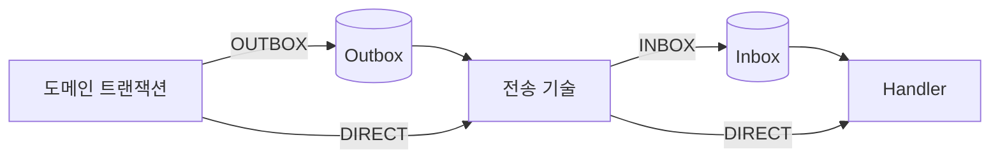

# 신뢰성 모드

[English](modes.md) | [한국어](modes.ko.md)

EventDock은 생산자와 소비자의 신뢰성을 독립적으로 선택합니다. 모든 조합이 동일한 이벤트 envelope, codec 및 transport를 사용합니다.

| 생산자 | 소비자 | 영속화 | 사용 사례 |
| --- | --- | --- | --- |
| `OUTBOX` | `INBOX` | 양쪽 | 중요한 서비스 간 상태 변경 |
| `OUTBOX` | `DIRECT` | 생산자만 | 발행 신뢰성이 필요하고 소비자는 지연에 민감하거나 자체 멱등성을 가진 경우 |
| `DIRECT` | `INBOX` | 소비자만 | 빠르게 발행하면서 소비자의 영속 중복 제거와 재시도가 필요한 경우 |
| `DIRECT` | `DIRECT` | 없음 | 알림 또는 다시 생성할 수 있는 비핵심 이벤트 |

조합별 전체 구현 가이드:

- [Outbox + Inbox](outbox-inbox.ko.md)
- [Outbox + Direct](outbox-direct.ko.md)
- [Direct + Inbox](direct-inbox.ko.md)
- [Direct + Direct](direct-direct.ko.md)



## 설정

기본값은 기존과 같은 `OUTBOX + INBOX`입니다.

```yaml
eventdock:
  producer:
    mode: outbox
  consumer:
    mode: inbox
```

기존 단일 listener에서는 두 값을 독립적으로 변경합니다. 다중 listener에서는 `eventdock.consumers`의 각 항목이 모드, topic, Kafka group 및 선택적인 eventType route를 가집니다. [다중 consumer binding](../spring-boot/multi-consumers.ko.md)을 확인합니다.

## 애플리케이션 계약

설정으로 생산자 신뢰성을 선택하려면 구체 Writer 대신 `EventWriter`를 주입합니다.

```java
private final EventWriter eventWriter;

@Transactional
void changeState(EventEnvelope<?> event) {
  repository.save(...);
  eventWriter.write(event);
}
```

- `OUTBOX`: `EventWriter`는 `OutboxWriter`이며 도메인 상태와 Outbox row가 함께 commit됩니다.
- `DIRECT`: `EventWriter`는 `DirectEventWriter`이며 직렬화한 이벤트를 즉시 전송합니다. 전송 후 도메인 트랜잭션이 rollback돼도 이벤트를 회수할 수 없습니다.

Spring Boot에서는 `INBOX`와 `DIRECT` 모두 `@EventDockHandler`가 붙은 `EventHandler` bean을 등록합니다. `INBOX`에는 순서, 영속 중복 제거 및 재시도 정책이 적용됩니다. Direct 처리는 `UnitOfWork`를 사용하지만 EventDock 영속화, 중복 제거 및 영속 재시도 상태가 없습니다. 기존 Registry API도 호환됩니다. 자세한 사용법은 [Handler 자동 등록](../spring-boot/handlers.ko.md)을 확인합니다.

## 실패 의미

- Outbox는 생산자 데이터베이스와 전송 기술 사이의 경계를 보호합니다.
- Inbox는 전송 기술과 소비자 데이터베이스 사이의 경계를 보호합니다.
- Direct 발행은 전송 실패 또는 전송 후 도메인 트랜잭션 rollback 시 유실되거나 잘못 전달될 수 있습니다.
- Direct 소비는 브로커 재전달로 다시 실행될 수 있으므로 중복이 중요하면 Handler가 자체 멱등성을 가져야 합니다.
- 어떤 모드도 분산 exactly-once 실행을 제공하지 않습니다.
