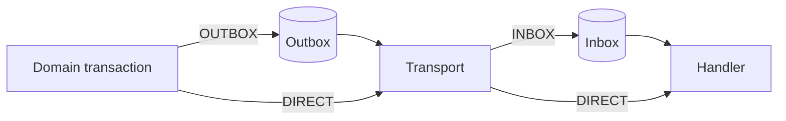

# Reliability modes

[English](modes.md) | [한국어](modes.ko.md)

EventDock selects producer and consumer reliability independently. The event envelope, codec, and transport remain identical across all combinations.

| Producer | Consumer | Persistence | Use case |
| --- | --- | --- | --- |
| `OUTBOX` | `INBOX` | Both sides | Critical cross-service state changes |
| `OUTBOX` | `DIRECT` | Producer only | Reliable publication with a latency-sensitive or naturally idempotent consumer |
| `DIRECT` | `INBOX` | Consumer only | Low-latency publication with durable deduplication and retries at the consumer |
| `DIRECT` | `DIRECT` | None | Notifications or rebuildable, non-critical events |



## Configuration

The default remains `OUTBOX + INBOX`.

```yaml
eventdock:
  producer:
    mode: outbox
  consumer:
    mode: inbox
```

Change either value independently. Consumer identity, topics, and processing switches remain under `eventdock.inbox` for compatibility with 0.1.x configuration.

## Application contracts

Inject `EventWriter` instead of a concrete writer when configuration should select producer reliability.

```java
private final EventWriter eventWriter;

@Transactional
void changeState(EventEnvelope<?> event) {
  repository.save(...);
  eventWriter.write(event);
}
```

- `OUTBOX`: `EventWriter` resolves to `OutboxWriter`; domain state and the Outbox row commit together.
- `DIRECT`: `EventWriter` resolves to `DirectEventWriter`; the encoded event is sent immediately. A later transaction rollback cannot retract it.

For an `INBOX` consumer, register `InboxHandlerRegistry`; ordering, durable deduplication, and retry policies apply. For a `DIRECT` consumer, either the same `InboxHandlerRegistry` or the transport-neutral `EventHandlerRegistry` can be registered. Direct handling uses `UnitOfWork` but has no EventDock persistence, deduplication, or durable retry state.

## Failure semantics

- Outbox protects the producer database-to-transport boundary.
- Inbox protects the transport-to-consumer database boundary.
- Direct publication may be lost if transport publication fails or the surrounding domain transaction rolls back after sending.
- Direct consumption may run again after broker redelivery; the application handler must be naturally idempotent when duplicates matter.
- No mode provides distributed exactly-once execution.
