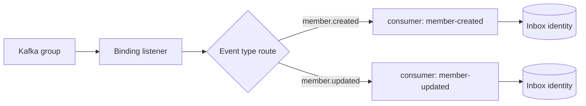

# Kafka Transport

[English](kafka.md) | [한국어](kafka.ko.md)

`eventdock-transport-kafka` maps `SerializedEvent` to Kafka without Spring. The payload stays as raw bytes. Event identity, schema, aggregate, timestamp, content type, and user metadata are stored in Kafka headers.

The default topic is the event type and the record key is `<aggregate-type>:<aggregate-id>`. Applications can replace `KafkaTopicResolver` when topic naming differs.

Publishing waits for the broker acknowledgement. A failed or timed-out send causes the outbox retry policy to run. Delivery is at least once; consumers must use the inbox path for idempotency.

Inbound records are persisted to the inbox before the Kafka listener returns. The starter provides dedicated `ByteArraySerializer` and `ByteArrayDeserializer` factories, isolated from existing JSON Kafka flows.

## Consumer bindings

The Spring Boot adapter creates one listener container per `eventdock.consumers` entry. Kafka `group-id` controls partition assignment, while the resolved EventDock `consumer-id` controls Inbox identity and handler lookup. A route may override consumer identity by event type inside one Kafka group.

See [multiple consumer bindings](../spring-boot/multi-consumers.md) for configuration and handler examples.
